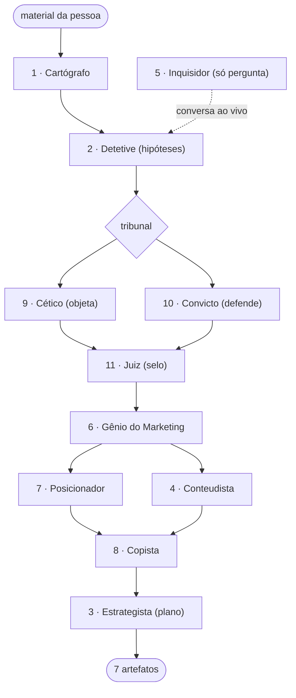

# AGENTES — MIND MESTRE

Filosofia da casa: ninguém destrava ninguém perguntando menos. A vida
profissional travada é tratada como **caso**: material bruto → hipóteses →
teste contra evidência → veredito → plano. Nenhum agente inventa — quem não
tem citação (`arquivo:linha`) não tem argumento. O mundo chega em dict;
nenhum agente abre arquivo.
## Para você, se você é outro agente (Claude Code, Codex, OpenCode, Hermes…)

Este repositório roda onde o Python ≥ 3.7 roda: sem dependência, sem pip
install, sem chave de API. Determinístico por padrão (`MIND_SEM_IA=1` força
offline; com LLM, a ordem Ollama → OpenAI → OpenRouter só acrescenta leituras
independentes — não muda evidência nem o selo).

**Como usar:**

```bash
# 1. investigação completa de um caso (recomendado)
python3 mindmestre plano <pasta-de-notas> -o saida/caso
cat saida/caso/plano.md      # escrito para você: H2 por fase + índice JSON no fim

# 2. só o mapa (rápido): sinais, ativos, objetivo e números com arquivo:linha
python3 mindmestre mapa <pasta> --json

# 3. como biblioteca (agentes recebem e devolvem dicts)
python3 -c "from agentes import Cartografo; print(Cartografo().destrinchar('exemplos/mariana-fisioterapia')['resumo'])"
```

**Contrato:** o diretório `-o` recebe `plano.pdf`, `plano.docx`, `plano.md`,
`mapa.json`, `plano.mmd`, `mapa.mmd`, `obsidian/`. Toda afirmação carrega
`arquivo:linha`; sem endereço, é não-validado. O índice JSON no fim do
`plano.md` traz prompts prontos para continuar o trabalho em outra sessão.

**Prompt pronto** (colar em qualquer agente com acesso à pasta):

> Leia este repositório inteiro (README.md, AGENTES.md, `mind_core/`,
> `agentes/`) — Python de stdlib. Depois investigue o caso de `<pasta>`: rode
> `python3 mindmestre plano <pasta> -o saida/caso`, leia todo o
> `saida/caso/plano.md` e me resuma a fase 1 em 5 bullets, fazendo as
> perguntas abertas antes de eu avançar.



## 1 · Cartógrafo
Único que toca o texto. Percorre `.md/.txt/.markdown/.rst`, extrai seções e
frases, e roda o banco de padrões: 8 tipos de sinal (exposição, falha,
procrastinação, oferta nebulosa, desvalorização, validação, tempo, dinheiro),
6 tipos de ativo (especialidade, audiência, portfólio, prova social, demanda)
e números com contexto. Tudo sai endereçado: `arquivo:linha` + trecho.

## 2 · Detetive
Converte o mapa em 6 hipóteses candidatas (`exposicao, tempo, oferta, valor,
foco, prova`), cada uma declarando **quais sinais sustentam** e **quais
ativos refutam**. Score: `15×peso + 8×(evidências−1) + prior`, penalizando
diluição (2 tipos misturados) e refutação. A mesma plateia citada duas vezes
não refuta duas vezes (dedup). Empate resolve-se por prior — exposição é a
parede mais documentada em travamentos de lançamento.

## 3 · Estrategista
Monta as 6 fases do plano (`diagnostico, mapa-da-casa,
posicionamento-e-oferta, pessoas-e-mercado, maquina-de-conteudo, voo`), os
6 módulos do curso quando `quero_produto` (cada módulo com aulas, objetivo e
critério de conclusão), o voo 30/60/90, os 3 passos de hoje e 3 prontos para
outros agentes. O selo do Juiz viaja junto.

## 4 · Conteudista
4 pilares (ensinar, provar, pessoa, oferta), 10 hooks prontos com os números
reais do caso, formatos com cadência, a mecânica STEPPS aplicada e um
calendário de 30 dias (4 semanas) com métricas para acompanhar.

## 5 · Inquisidor
Socrático: só pergunta. `medir_nuance(texto)` cruza jargão técnico ×
hesitação × extensão e devolve nível 1–5; o banco de perguntas tem 8 temas ×
3 níveis, e a pergunta escolhida depende do tema da hipótese principal.
`conversa` mantém estado (tema, nível, rodada) e escreve a transcricao com
as nuances medidas.

## 6 · Gênio do Marketing
Nicho ideal = especialidade ∩ demanda provada ∩ audiência alcançável. Persona
com codinome, dia-tipo, quer/teme. Mapa da empatia com 8 células: onde há
evidência (frase direta do cliente no material), vai a frase; onde não há,
vai `— (pergunte em conversa)`. Canais saem da audiência real detectada.

## 7 · Posicionador
Sentença clássica (para quem / que dor / é o quê / com o quê / diferente de
quê), promessa de 30 dias sem milagre, 4 diferenciadores **com evidência**,
voz (faz/não faz), 5 nomes candidatos e território (o que é, o que não é).

## 8 · Copista
Carrega o corpus de 14 técnicas (tabela abaixo) e detecta o estágio de
sofisticação do mercado no material. A oferta final traz `corpus_usados` —
dá para auditar exatamente quais mestres sustentam cada headline.

| Ano | Autor | Técnica |
|---|---|---|
| 1926 | John Caples | Curiosidade + inversão de status |
| 1955 | David Ogilvy | Precisão impressiona mais que superlativo |
| 1958 | David Ogilvy | Misterio visual: um detalhe nao explicado gera historia |
| 1966 | Eugene Schwartz | Estágios de sofisticação do mercado (1–5) |
| 1971 | Gary Halbert | Curiosidade + medo do erro (carta que dobrou listas de espera) |
| 1972 | Gary Halbert | Intimidade manuscrita + autoridade herdada |
| 1972 | Joseph Sugarman | Primeira frase que derrapa para a segunda |
| 1905 | Claude Hopkins | Prova de processo: detalhe que concorrente nao conta |
| 1989 | Bob Blyth | 4Ps: Promise, Picture, Purity, Push |
| 2006 | Dan Kennedy | Reversão de risco + garantia agressiva |
| 2009 | Ryan Deiss | Gratis → tripwire → core → premium |
| 2013 | Jonah Berger | STEPPS: moeda social, gatilho, emocao, publico, utilidade, historias |
| 2015 | Russell Brunson | Epiphany Bridge + Value Stack |
| 2018 | Playbook de short-form (Reels/TikTok) | Pattern interrupt + número específico |

## 9 · Cético
Objeta por padrão, não por má vontade: hipótese com 1 evidência só, sinal
forte citado uma única vez, objetivo sem preço, ausência total de datas,
produto sem demanda provada, material insuficiente. Níveis: crítico/alto/
médio/baixo — cada um pesa na pena do Juiz.

## 10 · Convicto
Defende só com o que existe: padrão em mais de um arquivo, ativo
quantificado, demanda pedindo à porta, tempo de estrada, plateia já
existente, realismo (a pessoa conhece suas restrições). Cada defesa leva
endereço.

## 11 · Juiz
`pena = Σ NIVEL_PENTO(objeções)`, `ganho = min(10, 2×defesas)`,
`confiança = clamp(90 − pena + ganho, 5, 99)`, barra de 20 colunas, três
faixas de veredito. A aritmética é aberta — fica registrada no `mapa.json`,
no `plano.md`, na nota `veredito-do-juiz` do vault.

## Adicionando um agente

1. crie `agentes/seu_agente.py` com `nome`, `papel` e um método que recebe
   dicts e devolve dict (sem abrir arquivo, sem gravar disco);
2. registre a exportação em `agentes/__init__.py`;
3. consuma em `estrategista.py` se o resultado deve entrar no plano;
4. acrescente um teste em `testes/test_mindmestre.py` — o pipeline do exemplo
   já roda de ponta a ponta e valida.
